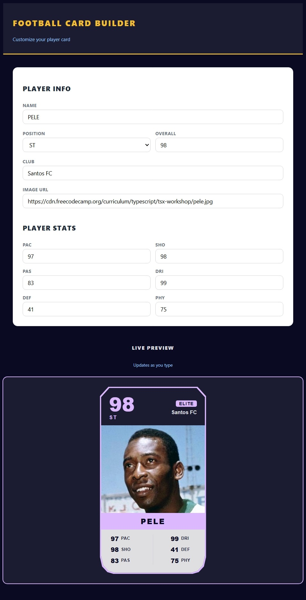

# ⚽ Football Player Card Builder

An interactive **JavaScript/TypeScript** web app that allows users to create and customize **football player cards**. Built to practice **React, TypeScript, modular code, and responsive UI design**.

---

## 🚀 Live Demo

[View Project](https://himanshu-kumar-2301.github.io/fcc-football-player-card-builder/)

---

## 🛠️ Tech Stack

- **React 19** - UI components
- **TypeScript** - type safety
- **Vite** - build tool & dev server
- **ESLint** - linting & code quality

---

## 📸 Preview



---

## 📚 Features

- **Dynamic card builder**: Input player details (name, position, stats) to generate a card.
- **Interactive UI**: Real‑time updates as you fill in the form.
- **TypeScript practice**: Strong typing for player data and card rendering.
- **Responsive design**: Cards adapt to different screen sizes.
- **Clean modular structure**: Organized in src/ with TypeScript configuration.

---

## 📂 Project Structure

```code
root/
|--public/
|--src/
|  |--index.css
|  |--main.tsx
|  |--components/
|  |  |--FootballPlayerCard.tsx
|  |  └──PlayerCard.tsx
|  └──assets/
|     └──screenshot.gif
|--index.html
|--package.json
|--vite.config.ts
|--tsconfig.json
|--README.md
```

---

## ⚡ Getting Started

1. Clone the repo:

    ```bash
    git clone https://github.com/Himanshu-Kumar-2301/fcc-football-player-card-builder.git
    ```

2. Navigate into the folder

    ```bash
    cd fcc-football-player-card-builder
    ```

3. Install dependencies

    ```bash
    npm install
    ```

4. Start the dev server

    ```bash
    npm run dev
    ```

---

## 📖 Learning Goals

- Practice **TypeScript basics** (interfaces, object typing).
- Explore responsive card layouts with React/CSS.
- Build confidence with modular project structure.

---

## 🌟 Future Improvements

- Add card export/download as image or PDF.
- Support multiple card layouts (e.g., fantasy team, trading card style).
- Add search/filter for saved players.

---
